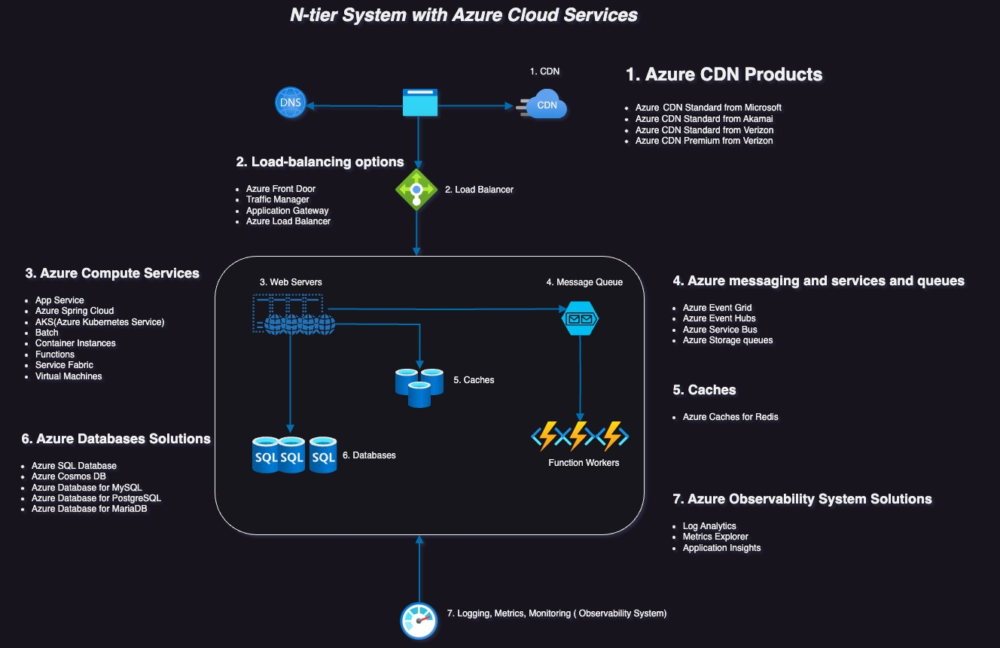
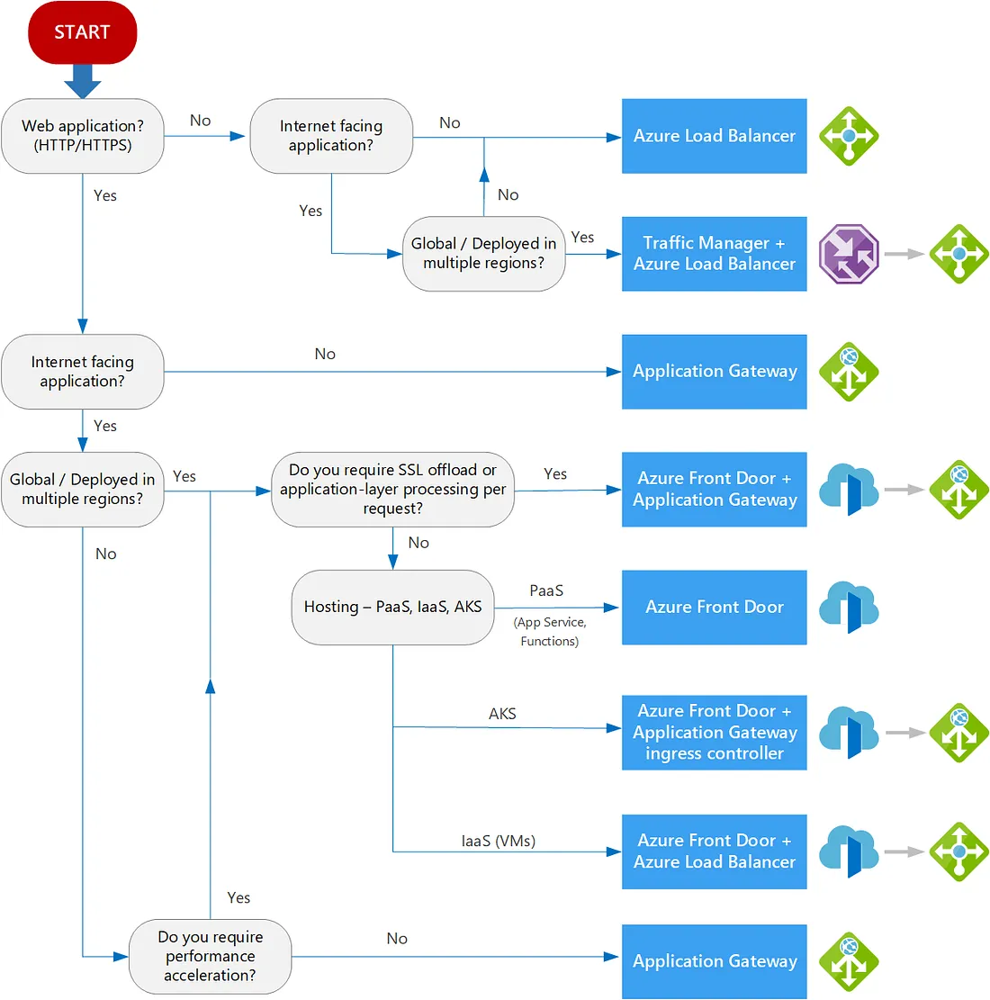
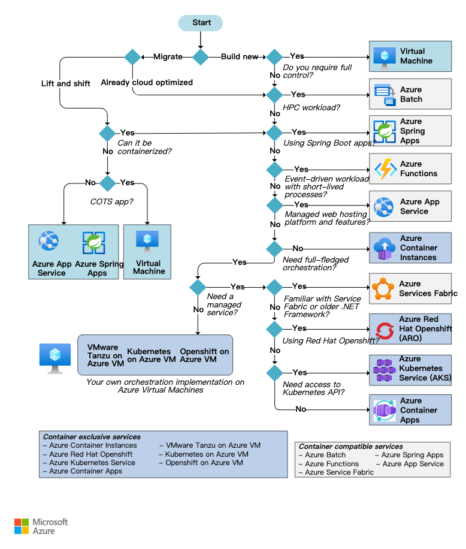
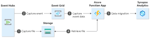
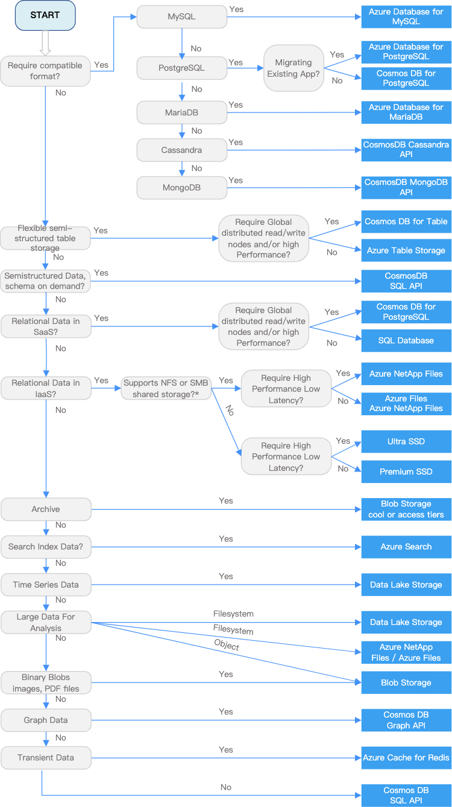
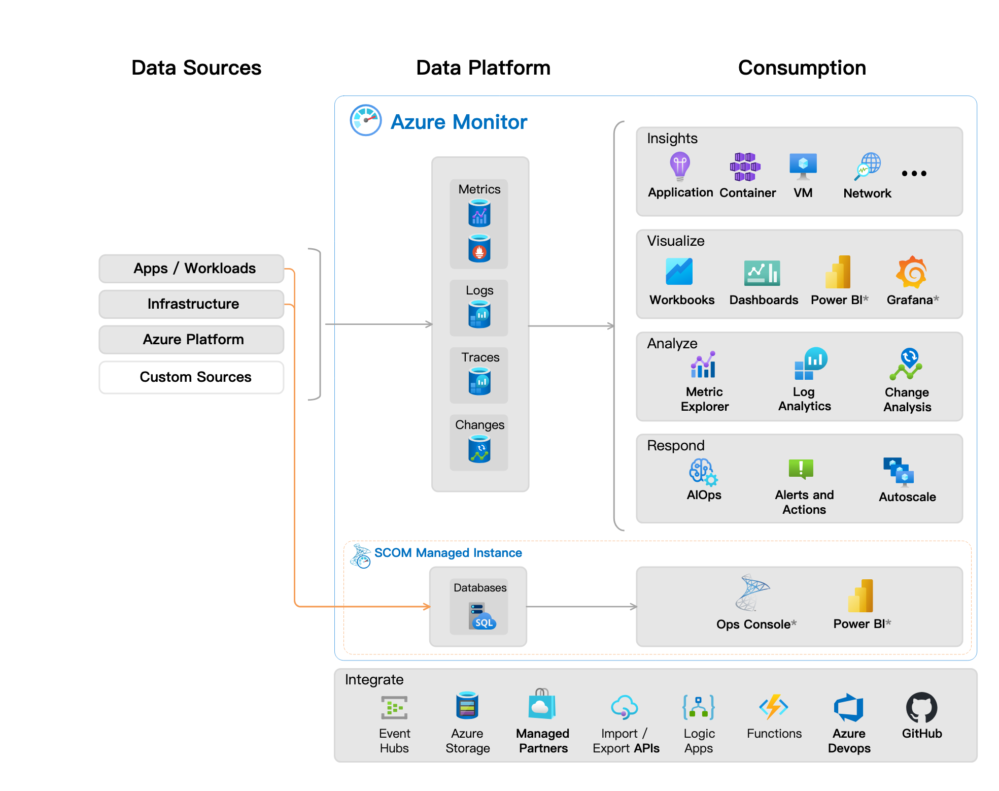

### Introduction 

---

Broken down a common system design and created this diagram that will walk you through some of the techniques and guide you on how to choose the right Azure services for your system.

### Architecture

---

### 1. Azure CDN Products

---

Azure Content Delivery Network (CDN) includes four products:
- Azure CDN Standard from Microsoft
- Azure CDN Standard from Akamai
- Azure CDN Standard from Verizon
- Azure CDN Premium from Verizon

### 2. Load-Balancing Options

---

Load balancing aims to optimize resource use, maximize throughput, minimize response time, and avoid overloading any single resource.
- Azure Front Door
- Traffic Manager
- Application Gateway
- Azure Load Balancer

How to choose a candidate service, we can refer to [Load-balancing options](https://learn.microsoft.com/en-us/azure/architecture/guide/technology-choices/load-balancing-overview?WT.mc_id=DT-MVP-5001664&source=post_page-----4c399b0f0639--------------------------------) on Azure official website documentation.

### 3. Azure Computing Services

---

Azure offers a number of ways to host your application code. The term compute refers to the hosting model for the computing resources that your application runs on.

- App Service
- Azure Spring Cloud
- Azure Kubernetes Service (AKS)
- Batch
- Container Instances
- Functions
- Service Fabric
- Virtual machines

How to choose a candidate service, we can refer to [Choose an Azure compute service](https://learn.microsoft.com/en-us/azure/architecture/guide/technology-choices/compute-decision-tree?WT.mc_id=DT-MVP-5001664&source=post_page-----4c399b0f0639--------------------------------) on Azure official website documentation.

### 4. Azure Messages Services and Queues

---

With a message queue, the producer can post a message to the queue when the consumer is unavailable to process it. The consumer can read messages from the queue later. Azure offers three services that assist with delivering events or messages throughout a solution and supports two types of queue mechanisms:

- Azure Event Grid
- Azure Event Hubs
- Azure Service Bus (queues)
- Azure Storage queues

How to choose a candidate service, we can refer to [Choose between Azure messaging services - Event Grid, Event Hubs, and Service Bus](https://learn.microsoft.com/en-us/azure/service-bus-messaging/compare-messaging-services?WT.mc_id=DT-MVP-5001664&source=post_page-----4c399b0f0639--------------------------------) on Azure official website documentation.

|  Service   | Purpose              | Type                                 | When to use             |
| --- |----------------------|--------------------------------------|-------------------------|
|  Event Grid  | Reactive programming | Event distribution (discrete events) | React to status changes |
|  Event Hubs  | Big data pipeline    | Event streaming (series)             | Telemetry and distributed data streaming                     |
|  Service Bus  |High-value enterprise messaging                 |   Message                                   |  Order processing and financial transactions                   |

Example of how to use these services together

### 5. Caches

---

A cache is a temporary storage area that stores the result of expensive responses or frequently accessed data in memory so that subsequent requests are served more quickly.

Azure Cache for Redis provides an in-memory data store based on the Redis software.[Caching guidance](https://learn.microsoft.com/en-us/azure/architecture/best-practices/caching?WT.mc_id=DT-MVP-5001664&source=post_page-----4c399b0f0639--------------------------------) on Azure official website documentation.

### 6. Azure Databases Solutions

---

Azure offers a number of managed data storage solutions, each providing different features and capabilities. You can choose between traditional relational databases and non-relational databases.

- Azure SQL Database
- Azure Cosmos DB
- Azure Database for MySQL
- Azure Database for PostgreSQL
- Azure Database for MariaDB

How to choose a candidate service, we can refer to [Select an Azure data store for your application](https://learn.microsoft.com/en-us/azure/architecture/guide/technology-choices/data-store-decision-tree?WT.mc_id=DT-MVP-5001664&source=post_page-----4c399b0f0639--------------------------------) on Azure official website documentation.

### 7. Azure Observability System Solutions

---

Azure observability system solutions helps you maximize the availability and performance of your applications and services. It delivers a comprehensive solution for collecting, analyzing, and acting on telemetry from your cloud and on-premises environments.

 

Refer to [Azure Monitor overview](https://learn.microsoft.com/en-us/azure/azure-monitor/overview?WT.mc_id=DT-MVP-5001664&source=post_page-----4c399b0f0639--------------------------------) on Azure official website documentation.